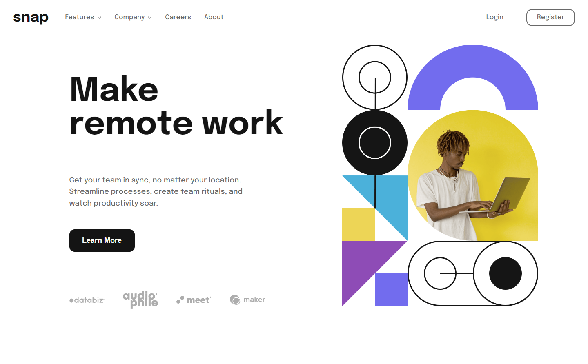

# Frontend Mentor - Intro section with dropdown navigation solution

This is a solution to the [Intro section with dropdown navigation challenge on Frontend Mentor](https://www.frontendmentor.io/challenges/intro-section-with-dropdown-navigation-ryaPetHE5). Frontend Mentor challenges help you improve your coding skills by building realistic projects. 

## Table of contents

- [Overview](#overview)
  - [The challenge](#the-challenge)
  - [Screenshot](#screenshot)
  - [Links](#links)
- [My process](#my-process)
  - [Built with](#built-with)
  - [What I learned](#what-i-learned)
  - [Continued development](#continued-development)
  - [Useful resources](#useful-resources)
- [Author](#author)
- [Acknowledgments](#acknowledgments)

## Overview

### The challenge

Users should be able to:

- View the relevant dropdown menus on desktop and mobile when interacting with the navigation links
- View the optimal layout for the content depending on their device's screen size
- See hover states for all interactive elements on the page

### Screenshot

### Links

- Live Site URL: [Live Site](https://calebsg225.github.io/FM-intro-section-w-dropdowns/)

## My process

I tried a mobile first approach this time... I don't plan on going back.

### Built with

- Typescript
- HTML5
- Sass (scss)
- Flexbox
- Grid
- Mobile-first workflow
- [React](https://reactjs.org/) - JS library

### What I learned

I learned how to have a navbar on desktop turn into a sidebar on mobile. Although I have used transitions in the past, this is the first time I have used them for padding and height to make the dropdowns smooth. I therefore learned something about transitions as well.

### Continued development

I notice that on desktop when I click the nav items or dropdown options in quick succession I highlight the text. In the future I should like to change all of these options into buttons.

### Useful resources

## Author

- Frontend Mentor - [@calebsg225](https://www.frontendmentor.io/profile/calebsg225)

## Acknowledgments